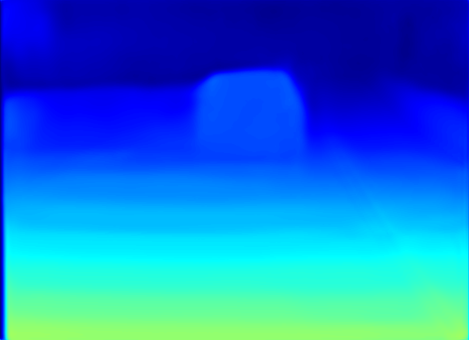
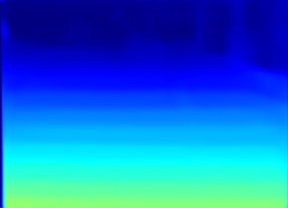
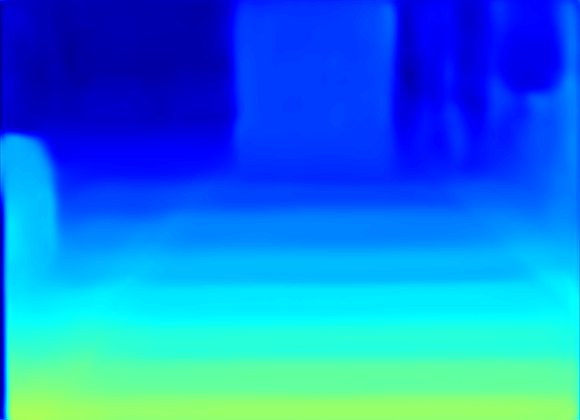

## Unofficial Pytorch implementation of - [Unsupervised Cross-spectral Stereo Matching by Learning to Synthesize](https://arxiv.org/pdf/1903.01078.pdf)

## Steps to train on Pittsburgh dataset:
- Set up the config file in `./config` folder, adjust the hyperparameters as per your need
- Download the pittsburgh RGB-NIR stereo dataset specify the location in the config file (`basepath`)
- Don't forget to execute  `pip install -r requirements.txt`

## Qualitative Results
| Left (RGB)  | Fake Left (NIR) | Right (NIR) | Fake Right (RGB) | Disparity |
| :-----------: | :------: | :-----: | :------: | :------: |
| |  |   | |  |
| |  |   | |  |
| |  |   | |  |

## Quantitative Results
|Method | Common  | Light   | Glass   | Glossy   |  Veg     | Skin     | Clothing |    Bag   | Mean |
| :----: | :-----: | :-----: | :-----: | :------: | :------: | :------: | :------: | :------: | :------: |
| From paper (STN + SMN) | 1.13 | 1.55 | 1.05 | 1.52 | 0.89 | 1.23 | 1.14 | 0.98 | 1.18 |
| This Implementation | 0.64 | 1.51 | 1.12 | 1.93 | 0.70 | 1.12 | 1.14 | 1.12 | 1.17 |

Comparing STN + SMN since the spectral transalation in this implementation is not F-cyclegan but the original cyclegan.
## Trained Weights:
- Weights are available at following --> [link](https://drive.google.com/drive/folders/1g0eLttO6W9YYuFfIgPQoGF9ixR1cjPkC?usp=sharing).
- Download them and place in the folder where you will be saving your weights (`./weights` according to the default config file)
- The weights will be saved in the following a particular format, for eg. `[epoch]_net_G_A.pth` and `latest_net_G_A.pth` which signifies the latest checkpoint, you can specify the epoch you want to load weights from in the config file.

## Training
- The model follows iterative optimization technique as described in the paper.
- Only CycleGAN is trained for 10 epochs, thus set `warmup: True` in config file
- Change `warmup: False` for training combined step 1,2,3,4 
- For quantitative results, prepare a config file (eg. `pittsburgh_test.yaml`) and run `python test.py --config ./configs/pittsburgh_test.yaml`

## Summary
- Summaries are created inside `./summary` folder
- to view loss logs run `tensorboard --logdir ./summary`

## Differences from the original Paper
- The spectral translation network is cyclegan and not F-cyclegan
- The weights of the losses are different, for some reason the network was not converging with the default loss weights for my training setup.
- The model is not optimized for best performance since I don't have the hardware and rely on Colab :)
