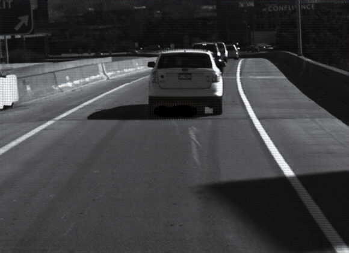

## Pytorch implmentation of the paper --> [Unsupervised Cross-spectral Stereo Matching by Learning to Synthesize](https://arxiv.org/pdf/1903.01078.pdf)

## Steps to train on Pittsburgh dataset:
- Set up the config file in `./config` folder, adjust the hyperparameters as per your need
- Download the pittsburgh RGB-NIR stereo dataset specify the location in the config file (`basepath`)
- Don't forget to execute  `pip install -r requirements.txt`

## Qualitative Results
CycleGAN results
| Left (RGB)  | Fake Left (NIR) | Right (NIR) | Fake Right (RGB) |
| :-----------: | :------: | :-----: | :------: |
| |  |   | |
| |  |   | |
| |  |   | |

**The last row is a failure case. As can be seen, the color of the bus is not properly transferred by the GAN**

- Stereo Matching Results
    - **Available very soon**

## Quantitative Results
- **Available Soon**

## Trained Weights:
- Weights are available at following --> [link](https://drive.google.com/drive/folders/1g0eLttO6W9YYuFfIgPQoGF9ixR1cjPkC?usp=sharing).
- Download them and place in the folder where you will be saving your weights (`./weights` according to the default config file)
- The weights will be saved in the following a particular format, for eg. `[epoch]_net_G_A.pth` and `latest_net_G_A.pth` which signifies the latest checkpoint, you can specify the epoch you want to load weights from in the config file.

## Training
- The model follows iterative optimization technique as described in the paper.
- Only CycleGAN is trained for 10 epochs, thus `warmup: True, stereo: False, auxilary: False` in config file
- Change `warmup: False, stereo: True, auxilary: False` for training the Stereo Matching Network for another 2-3 epochs
- Change `warmup: False, stereo: False, auxilary: True` for the global optimization stage, i.e., auxilary loss
- For quantitative analysis, prepare a config file (eg. `pittsburgh_test.yaml`) and run     `python test.py --config ./configs/pittsburgh_test.yaml`

## Summary
- Summaries are created inside `./summary` folder
- to view loss logs run `tensorboard --logdir ./summary`
